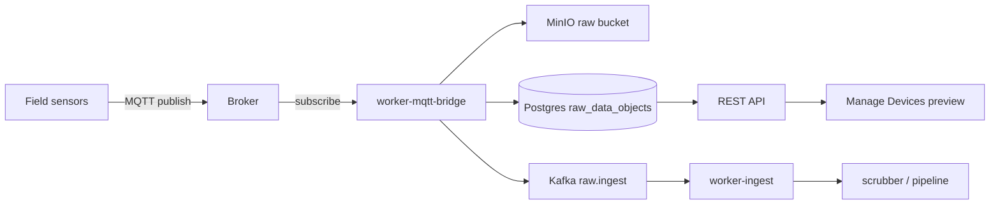

# Architecture: MQTT telemetry ingest

Multi-protocol product rules: **`docs/CANONICAL_INGRESS_PRODUCT.md`**.

## Two product roles (do not conflate)

| Role | Direction | Where it lives | Configuration |
|------|-----------|----------------|---------------|
| **MQTT ingest** | Platform is **subscriber / client** → connects to a broker and **consumes** topics | **`worker-mqtt-bridge`** | **Per device** in Manage Devices → MQTT device endpoint (`device_endpoints.config`) |
| **MQTT published services** | Platform is **publisher / client** → **sends** messages to a broker | **`publish_dispatch`** (API / workers), workflow outbound | **Separate** targets (e.g. platform port defaults, publish target JSON) — **not** the ingest bridge |

For **Manage Devices** and **raw ingest**, only **ingest** matters. Published-services MQTT does not subscribe on behalf of devices and does not replace the bridge.

---

## Phase 1 ingest model (explicit)

**Multiple broker connections, grouped by saved endpoint profile.**

1. The bridge loads all **active** MQTT device endpoints (`protocol = mqtt`, `is_active`, device `is_active`).
2. Each row supplies **`broker_mode`**, **`broker_host`**, **`broker_port`**, **`use_tls`** (or port `8883` implies TLS), **`username` / `password`**, optional **`client_id`**, **`topic`**, **`qos`** — the same JSON the UI saves (see `services/frontend/src/lib/deviceEndpointConfig.ts` → `mqttFieldsToConfig`).
3. Endpoints are **bucketed** by a **connection key**: `(host, port, TLS, username, password, explicit client_id)`.  
   - **`broker_mode: internal`** with empty host is normalized to **`mosquitto`** (in-stack broker hostname on the Docker network).
4. For each bucket, the bridge runs **one MQTT subscriber client** (one TCP/TLS connection) with a deterministic **`mqtt_client_id`** (explicit from config, or `MQTT_CLIENT_ID` + hash of the connection key).
5. On that connection, it **subscribes** to the **union of topics** for all endpoints in the bucket. If two endpoints share the same topic pattern, **QoS = max** of the two. Subscription provenance (endpoint id, device id, device name) is kept for **logs and Redis snapshot**.
6. **Optional ops hook:** comma-separated **`MQTT_TOPICS`** env subscribes on **`MQTT_BROKER_HOST` / `MQTT_BROKER_PORT`** (and env auth) only — **not** per device. If `MQTT_TOPICS` is set without `MQTT_BROKER_HOST`, those patterns are skipped with a warning.

There is **no** single global broker for device-driven ingest: **`MQTT_BROKER_HOST` is not** used for per-device subscriptions (only for the optional `MQTT_TOPICS` fallback).

---

## Supported broker deployments

| Mode | Description |
|------|-------------|
| **Platform-hosted** | **Mosquitto** in Compose. In Manage Devices, **internal** + host **`mosquitto`** (default) and port **1883** (container). Host port mapping default **18883→1883** (see `MQTT_BROKER_PUBLISH_PORT`). |
| **External** | **External** broker mode (or any reachable host). The bridge uses the **saved** `broker_host` / `broker_port` for that device’s bucket. The container must **reach** that host (LAN IP, `host.docker.internal`, DNS, etc.). |

Ingest pipeline: **MinIO** + **Postgres `raw_data_objects`** + optional Kafka **`raw.ingest`** — same as HTTP **`POST /ingest/raw`**.

Official in-stack pieces:

- **`mosquitto`** — broker (optional if **all** ingest is to external brokers).
- **`worker-mqtt-bridge`** — **subscriber** → archive → Kafka notification.

---

## End-to-end data flow (ingest)

---

## Logging (ingest)

At **INFO**, the bridge logs:

- **Connect:** `mqtt_bridge ingest connecting broker_host=… broker_port=… tls=… auth=… mqtt_client_id=… topics=[…]`
- **Connected:** `mqtt_bridge ingest connected broker_host=… broker_port=… tls=… auth=… mqtt_id=…`
- **Subscribe:** `mqtt_bridge subscribed topic=… qos=… broker=host:port sources=[{endpoint_id, device_id, device_name}, …]`
- **Receive / archive:** `mqtt_bridge received …` / `mqtt_bridge archived raw ingest …` (includes `broker=host:port`)

Env **`MQTT_INGEST_TLS_INSECURE=true`**: disables TLS cert verification (development only).

---

## Redis operational snapshot

Key **`aar:ingress:mqtt_bridge:snapshot`** (JSON): `last_resync_at`, flat `subscribed_topics`, `resync_interval_seconds`, and **`connections`**: per-connection `broker_host`, `broker_port`, `use_tls`, `auth_mode`, `mqtt_client_id`, `subscriptions[]` with `topic`, `qos`, `sources[]`.

The API exposes this (plus per-device **ingest routes**) via Manage Devices observability.

---

## Environment variables (worker `worker-mqtt-bridge`)

| Variable | Purpose |
|----------|---------|
| `MQTT_CLIENT_ID` | Prefix for auto-generated client ids when endpoint omits `client_id` |
| `MQTT_TOPICS` | Optional extra subscribe patterns on **`MQTT_BROKER_HOST`** only |
| `MQTT_BROKER_HOST` / `MQTT_BROKER_PORT` | Broker for **`MQTT_TOPICS`** only |
| `MQTT_USERNAME` / `MQTT_PASSWORD` | Auth for **`MQTT_TOPICS`** connection |
| `MQTT_BROKER_USE_TLS` | TLS for **`MQTT_TOPICS`** connection (`true` / `1`) |
| `MQTT_FALLBACK_CLIENT_ID` | Optional explicit client id for the **`MQTT_TOPICS`** connection |
| `MQTT_TOPIC_RESYNC_SECONDS` | Reload DB plan and reconnect if changed (default 90) |
| `MQTT_INGEST_TLS_INSECURE` | Dev only: insecure TLS for **ingest** connections using TLS |

`METADATA_DATABASE_URL`, MinIO, Kafka, Redis: unchanged.

---

## Environment variables (API — monitoring / probes)

| Variable | Purpose |
|----------|---------|
| `PLATFORM_MQTT_BROKER_ENABLED` | Mosquitto row + TCP probe when deployed |
| `MQTT_BRIDGE_DEPLOYED` | Expect `worker-mqtt-bridge`; heartbeats + monitoring |
| `MQTT_BROKER_PROBE_HOST` / `MQTT_BROKER_PROBE_PORT` | API probe target for **in-stack** Mosquitto |
| `PLATFORM_MQTT_EXTERNAL_HOST_HINT` | Documentation hint for operators (not ingest routing) |

---

## Device identity in payloads

Bridge payloads must resolve to registered devices (**UUID** or **name** + optional **site**). See **`docs/CANONICAL_DEVICE_IDENTITY_INGEST.md`**.

---

## Debugging failed ingest

When `mqtt_bridge ingest failed` appears, **always** search the same time window for **`ingest_trace`** in `worker-mqtt-bridge` logs (`docker compose logs worker-mqtt-bridge | grep ingest_trace`). Phases:

| `phase=` | Meaning |
|----------|---------|
| `quarantine` | Binding / policy rejection; row in **`ingest_quarantine`** (`reason_code`, `attempted_binding_json`). |
| `binding` | e.g. `device_inactive` (no quarantine row). |
| `persist` | MinIO, `raw_data_objects` insert, or Kafka after archive (`raw_id` in log for DB/MinIO lookup). |

Upstream payloads should include **`run_id`** or **`trace_id`** (string) so logs correlate with device/simulator traces.

---

## Related code

- Ingest bridge: `services/workers/app/mqtt_bridge.py`, `services/workers/app/mqtt_bridge_subscriptions.py`
- Archive path: `services/workers/app/ingest_archive.py`
- **Published-services** MQTT (separate): `services/workers/app/publish_dispatch.py`, `services/api/app/services/publish_dispatch.py`
