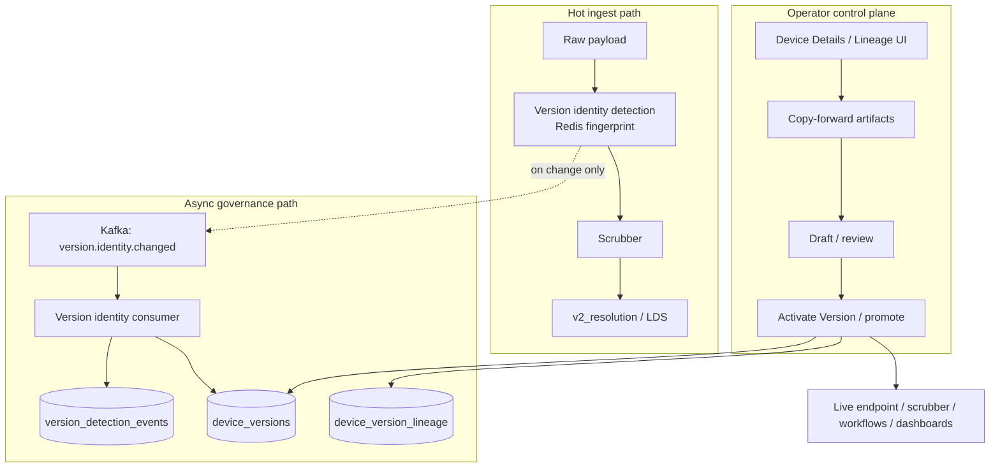

# Device Version Governance — Design Document

**Status:** Living design (post–v8 mainline + governance pivot)  
**Audience:** Product, platform engineering, operators  
**Normative detail:** [DEVICE_VERSIONING_SPEC.md](./DEVICE_VERSIONING_SPEC.md), [ENDPOINT_VERSION_IDENTITY.md](./ENDPOINT_VERSION_IDENTITY.md)  
**Delivery tracking:** [ROADMAP.md](./ROADMAP.md)  
**Full platform requirements (v1–v8+):** [CONSOLIDATED_REQUIREMENTS.md](./CONSOLIDATED_REQUIREMENTS.md)

---

## 1. Executive summary

AAR IoT Studio must operate **mixed-fleet, evolving devices** without silently breaking dashboards, workflows, or KPI semantics. The platform treats each **device version** as an **immutable, schema-bound snapshot** of how that logical device was wired at a point in time. Version changes are **detected, recorded, reviewed, and activated explicitly**—never inferred or auto-promoted on the hot ingest path.

**v8 (delivered)** established immutable `device_versions`, lineage, static impact, replay simulation MVP, promote/isolate/rollback APIs, and operational UI (Device Details hub, footprint, KPI compare).

**Post–v8 (current direction)** shifts fleet rollout orchestration away from an in-product **OTA campaign control plane** toward **governance-first versioning**: raw-payload **endpoint version identity detection**, append-only **detection events**, a **`detected → draft → active → deprecated`** lifecycle, and **copy-forward → review → Activate Version** before production artifacts change.

This document states **why** that model exists, **what** it must achieve, and **how** major components cooperate. Implementation locks remain in the normative specs above.

---

## 2. Problem statement

Industrial IoT platforms routinely face:

| Pain | Without governance |
|------|-------------------|
| Firmware / config drift | Dashboards bind to paths that no longer exist; KPIs lie or go null without explanation |
| Scrubber or schema edits | “Same” device row mutates in place; simulation and compare use inconsistent baselines |
| Breaking payload shapes | Incompatible telemetry pollutes shared pipelines used by live workflows |
| Fleet heterogeneity | Some devices on v1, some on v2; operators cannot see *which* contract is live |
| Rollout mistakes | Promotion to production is implicit (ingest continues on whatever scrubber is latest) |

**Core failure mode:** operational artifacts (scrubber, endpoint, workflow, dashboard) **drift together invisibly** while the product still presents a single “the device.”

---

## 3. Objectives

### 3.1 Primary objectives (must achieve)

1. **Immutable version truth**  
   Every material change to firmware, config, ingest shape, scrubber, endpoint attachment, or explicit operator cut creates a **new** `device_versions` row. Existing rows are never mutated in place for contract-defining fields.

2. **No silent operational drift**  
   Dashboards resolve fields **`attribute_id` first, path second** (see DEVICE_VERSIONING_SPEC §1). Default live reads use the **`active`** version for a `resolved_device_id` only.

3. **Evidence before governance**  
   Version drift observed on the wire is recorded as **`version_detection_events`** (append-only). Canonical governance rows (`device_versions`) link to that evidence; multiple detections may occur before an operator acts.

4. **Hot path stays fast and available**  
   Fingerprint comparison uses **Redis**; **no synchronous** `device_version` / lineage writes on ingest. Scrubber and `v2_resolution` **always proceed** unless a separate ingest policy blocks deprecated/rolled-back versions.

5. **Explicit promotion to production**  
   Production bindings do not auto-follow detection. Operators **copy-forward** staged artifacts, **review**, then **Activate Version** (promote), which deprecates the prior active shared-lane version and applies accepted artifacts to live configuration.

6. **Superseded artifacts are frozen, not deleted**  
   When a new version supersedes another, prior scrubber/endpoint/workflow/dashboard bindings for that version move to **`Frozen-Inoperable`** (readable for audit; not used for live shared pipeline). Only the **scrubber definition** is copied forward as a **starting draft**; endpoint/workflow/dashboard require explicit re-attachment.

7. **Device-scoped versioning**  
   Version cuts are per **registered device** / `resolved_device_id`, not mass-updated across all devices on an endpoint.

8. **Layer on existing data (v1 constraint)**  
   No mandatory bulk migration of historical raw ingest, scrubbed stores, or dashboard bindings. New tables and policies **coexist** with legacy rows.

### 3.2 Secondary objectives (should achieve)

1. **Operator-visible lineage** — Answer *why* a version exists, *what* changed, and *which* artifacts were frozen (timeline, footprint modal, KPI compare with deep links).

2. **Pre-promotion safety nets** — Static **impact analysis** (workflows, dashboards, field catalog), structural **replay simulation**, and compatibility/routing lanes where still applicable.

3. **Unified identity configuration** — Scrubber2 semantics can drive endpoint primary-key and label paths (`identity_managed_by_scrubber`), reducing duplicate identity UIs when the scrubber is the source of truth.

4. **Auditability** — Control-plane audit events for version lifecycle actions; RBAC gates (`device_versions.*`, `lineage.read`, `audit.read`, etc.).

### 3.3 Non-objectives (explicitly out of scope or retired)

| Item | Rationale |
|------|-----------|
| **In-product OTA campaign executor** | Removed from application tree; fleet delivery is external. `ota_supported` / `firmware_channel` remain **declared readiness metadata** only. |
| **`candidate_lane` for governance v1** | Parallel candidate ingest for governance deferred; detection does not block scrubber. Candidate LDS may remain for legacy routing experiments (see CANDIDATE_LANE_CONSUMERS.md). |
| **Live schema inference in diff/compare** | `schema_diff_engine` uses stored **device_version** snapshots only. |
| **Versioning cockpit inside device registration** | Registration stays identity + readiness metadata; governance UX lives on Device Details / lineage surfaces. |

---

## 4. Design principles

1. **Separation of detection and decision** — Observing drift ≠ promoting a version.  
2. **One row per version, status transitions** — Do not mint a new `device_versions` row per status change; immutable fields stay fixed after set.  
3. **Raw before scrubber for identity** — Version fingerprints come from **raw JSON** at configured JSONPaths, not scrubber output (avoids rename/flatten drift).  
4. **Shared pipeline integrity** — Breaking versions must not enter the shared operational pipeline without explicit promote.  
5. **Telemetry continuity with read discipline** — Ingest may still store telemetry when devices lag configuration; **default operational resolution** maps to **active** only.  
6. **Caller-owned persistence for bootstrap** — Bootstrap lineage rows flush in helpers; API handlers commit when persistence is intended.

---

## 5. Conceptual architecture



### 5.1 Responsibility matrix

| Layer | Owns | Does not own |
|-------|------|----------------|
| **Endpoint** | `version_identity` config (paths, fingerprint rules, discovery policy); optional `identity_managed_by_scrubber` | Scrubber schema semantics |
| **Worker (pre-scrubber)** | Raw parse, extract, fingerprint, Redis compare, deduped event publish | Synchronous `device_versions` writes (default) |
| **Redis** | Last fingerprint, bootstrap keys (`endpoint`+`pk_hash` → `rdev`) | Long-term audit |
| **Version identity consumer** | `version_detection_events`, `device_versions` (`detected`), LDS `system_json.version_identity` flags | Blocking scrubber |
| **Scrubber** | Telemetry transformation, KPI field catalog | Version lifecycle decisions |
| **API lifecycle services** | Draft submit, copy-forward, promote/deprecate/isolate/rollback, lineage, impact, simulation | Hot-path ingest |
| **Device ingest policy** | Block ingest for terminal statuses (`deprecated`, `rolled_back`) | Version detection |

---

## 6. Version lifecycle (governance model)

```text
detected ──(operator: submit for review)──► draft ──(copy-forward + review)──► draft (artifacts staged)
                                                      │
                                                      ▼
                                              Activate Version (promote)
                                                      │
                                                      ▼
                                                   active ──► deprecated (superseded)
```

| Status | Meaning |
|--------|---------|
| **detected** | Fingerprint change observed; not yet in operator review queue for production |
| **draft** | Under review; `activation_artifacts_json` may hold staged endpoint/scrubber/workflow/dashboard snapshots |
| **active** | At most one **active** version per device on the **shared** lane for default operational reads |
| **deprecated** | Superseded; historical reads only; ingest may be blocked per policy |
| **rejected** / **isolated** / **rolled_back** | Governance outcomes per lifecycle APIs (see implementation) |

**Immutable after set (examples):** `identity_fingerprint`, `created_from_detection_event_id`, `resolved_device_id`, provenance snapshots.  
**Mutable:** `status`, `activated_at`, `deprecated_at`, review metadata, `activation_artifacts_json` during draft.

---

## 7. Version creation triggers (closed list)

A **new** `device_versions` row is required when **any** of the following holds (DEVICE_VERSIONING_SPEC §8, §13):

| Trigger | Mechanism |
|---------|-----------|
| **Ingest payload shape change** | Deterministic fingerprint of ingest contract / `fieldCatalog` (`ingest_shape` lineage) |
| **Explicit version creation** | Operator or API supplies a new version label |
| **External rollout** | OTA or out-of-band firmware/config change that alters versioned surfaces (metadata flags alone on v8 registration **do not** auto-mint) |
| **§8 drift events** | Scrubber config, endpoint attachment, workflow binding changes per immutability rules |

If none apply, the platform **must not** create a spurious version.

**Endpoint version identity** feeds the **detected** path: each distinct fingerprint → detection event → upsert/link `device_versions` row (async), without replacing explicit promotion.

---

## 8. Activation and copy-forward

**Objective:** Prevent silent reuse of production wiring when a new version goes live.

1. **Copy-forward** (`copy_forward_activation_artifacts`) snapshots baseline **endpoint**, **scrubber mapping**, **workflows**, and **dashboards** from the prior active (or chosen) version onto a **draft** cut for diff and review.  
2. **Gate** — Promote requires staged artifacts (activation gate).  
3. **Activate Version** — Promote deprecates other active shared-lane rows, sets `devices.device_version` label, appends lineage (`version_promoted`), applies accepted activation to live rows, records **frozen operational summary** for superseded bindings.

Customer-facing label: **Activate Version** (not “scrubber freeze”).

---

## 9. Endpoint version identity detection

**Objective:** Discover firmware/software/config changes from **live traffic** before operators manually cut a version.

| Step | Behavior |
|------|----------|
| Config | Endpoint `version_identity` JSON: paths, `fingerprint_fields`, discovery policy, `discovery_completed` |
| Extract | Configured JSONPaths on **raw** payload only |
| Fingerprint | `sha256(canonical_json(values))` with normalized keys |
| Compare | Redis; bootstrap key until `resolved_device_id` exists, then migrate to `rdev` key |
| Event | Kafka `version.identity.changed` (deduped per new fingerprint) |
| Persist | Consumer writes `version_detection_events` + `device_versions` (`detected`) |
| LDS flags | `system_json.version_identity` (not `identity_json`) |

**Acceptance themes:** at-most-one deduped event per fingerprint change; scrubber never required for detection; REST/archive/passthrough parity.

---

## 10. Scrubber-managed identity

**Objective:** When Scrubber2 semantics already declare primary-key and display roles, operators should not maintain a parallel identity-mapping UI.

- Endpoint flag: `identity_managed_by_scrubber`  
- On scrubber freeze or device–endpoint link, service derives PK/label paths from published pipeline semantics and validates against a scrubbed sample document.  
- Complements (does not replace) endpoint `version_identity` for **firmware/config fingerprinting**.

---

## 11. Ingest policy

**Objective:** Terminal version statuses do not accept new telemetry that would imply the device is still operationally live on a retired contract.

- `device_version_status_allows_ingest()` returns false for `deprecated` and `rolled_back` (API and workers share policy module).  
- Detection and storage rules for lagging devices remain governed by ENDPOINT_VERSION_IDENTITY § governance (telemetry may still be stored; **reads** default to active).

---

## 12. Data model (conceptual)

| Entity | Role |
|--------|------|
| `devices` | Registered device; current display version label; site scope |
| `device_versions` | Immutable version snapshots; status, lane, fingerprints, activation/frozen JSON |
| `device_version_lineage` | Event timeline (triggers, promote, freeze, explicit cuts) |
| `version_detection_events` | Append-only drift evidence |
| `endpoints.version_identity` | Detection configuration |
| `endpoints.identity_managed_by_scrubber` | Scrubber-owned PK/label paths |
| `latest_device_state.system_json` | Runtime version identity flags for UI |
| `control_plane_audit_events` | Security/audit trail for lifecycle actions |

Historical DB tables from OTA migrations may exist in deployed databases; application code no longer drives campaign execution.

---

## 13. User-facing surfaces

| Surface | Purpose |
|---------|---------|
| **Device registration (v8)** | Identity, profile, OTA readiness metadata only |
| **Device Details hub** | Overview, versions, lineage, simulation |
| **Operational footprint** | Workflows, dashboards, endpoint, scrubber blast radius |
| **Version history / lineage** | Timeline, KPI compare (`compareA` / `compareB`), deep links |
| **Ingest devices UI** | Policy hints when ingest blocked for version status |
| **Endpoint identity panel** | `version_identity` paths, discovery state, managed-by-scrubber indicator |
| **Administration → Control plane audit** | Audit read path for privileged roles |

---

## 14. Security and permissions

- Site-scoped RBAC: `device_versions.read`, `device_versions.promote`, `device_versions.deprecate`, `lineage.read`, `audit.read`, `simulation.run`, etc.  
- UI gates align with catalog keys; sensitive lifecycle actions emit audit events.  
- Version identity: cached paths only after discovery; no full-document scan every ingest.

---

## 15. Success criteria (measurable outcomes)

1. Operator can see **when** firmware/config fingerprint changed and **which** detection event created a version row.  
2. **No** dashboard widget silently switches schema without an explicit active version and binding resolution path.  
3. Promoting a draft **deprecates** prior active version and leaves superseded artifacts **frozen** but auditable.  
4. Ingest p99 impact from version detection is bounded (Redis compare only on hot path).  
5. Mixed fleet: two devices on same endpoint can hold different active version labels without mass endpoint-driven version explosion.  
6. Simulation/impact APIs report blast radius **before** activate.  
7. Registration edit of `ota_supported` / `firmware_channel` alone does **not** mint a version (v8 carve-out holds).

---

## 16. Open work (post–v8 backlog)

Aligned with [ROADMAP.md](./ROADMAP.md):

- Firmware **artifact library** (binaries/manifests) without in-app OTA executor  
- **Simulation depth** — full scrubber/workflow re-execution vs structural MVP  
- **Dashboard live candidate lane** — optional read path against `candidate_latest_device_state`  
- **Audit + RBAC hardening** — broader grants, richer payloads  
- Scrubber **decode_series** deferred modes (see SCRUBBER_DECODE_SERIES_SPEC.md)

---

## 17. Related documents

| Document | Contents |
|----------|----------|
| [DEVICE_VERSIONING_SPEC.md](./DEVICE_VERSIONING_SPEC.md) | Normative locks: binding rules, frozen-inoperable, triggers, edge cases |
| [ENDPOINT_VERSION_IDENTITY.md](./ENDPOINT_VERSION_IDENTITY.md) | Detection pipeline, Redis keys, governance lifecycle locks |
| [ROADMAP.md](./ROADMAP.md) | Delivered vs open milestones |
| [CANDIDATE_LANE_CONSUMERS.md](./CANDIDATE_LANE_CONSUMERS.md) | Candidate LDS read paths |
| [CANONICAL_DEVICE_IDENTITY_INGEST.md](./CANONICAL_DEVICE_IDENTITY_INGEST.md) | Endpoint-bound vs payload-resolved ingest |

---

## 18. One-line system definition

The platform treats every device version as an **immutable, schema-bound snapshot**; **raw-payload detection** records drift without blocking ingest; operators **copy, review, and activate** before production artifacts change; superseded bindings become **frozen-inoperable**; **lineage and KPI compare** explain what changed and why—without silent dashboard drift or mandatory historical data rewrite.
