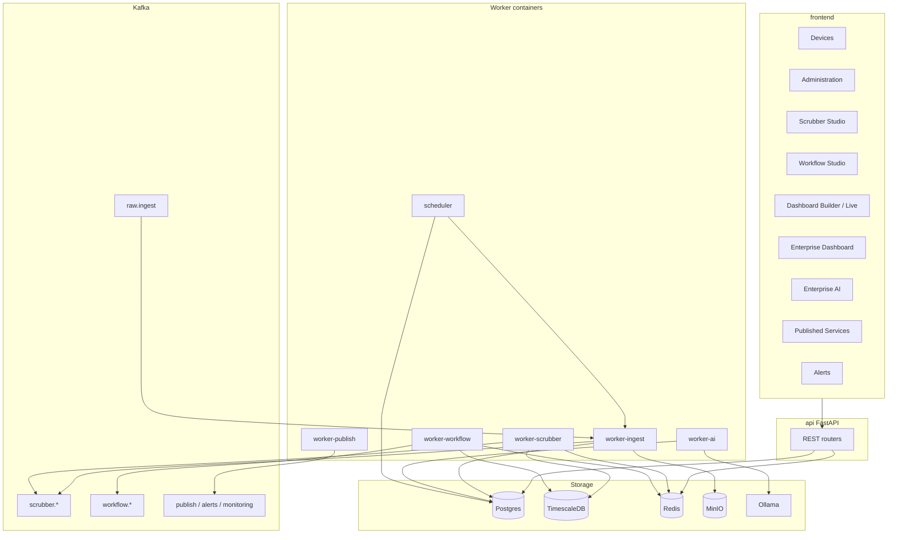

# AAR-IoT-Studio — Enterprise features & engineering baseline (single source of truth)

Portable description of **Scrubber**, **device / data source configuration**, **Dashboards**, **Enterprise Dashboard** (primary), **Enterprise AI**, and the **Phase 1 platform architecture**. This document is the **formal engineering baseline** for DDL, APIs, workers, Kafka, Redis, Docker Compose, frontend routes, and runtime behavior.

**Primary app:** `frontend/` (React + Vite) → **api** (FastAPI).  
**Reuse policy:** Import and adapt prior **Scrubber Studio**, **Workflow Studio**, **Dashboard Builder**, **Enterprise Dashboard**, **Enterprise AI**, **Workload Studio**, **Monitoring**, and **Published Services** — do not rewrite from scratch; plug them into this canonical architecture.

---

## Export package index

| Section | Contents |
|---------|----------|
| **0** | Canonical stack, tenancy, AI mode, scope boundaries |
| **0.4** | Scrubber canonical model — runtime source of truth, Save / Compile / Publish, validation |
| **0.5** | **Final navigation** (authoritative) |
| **0.6** | **UI / UX** — font tokens, Aptos / fallbacks, tablet/workstation, no scrollbars |
| **0.7** | **Restore to Default** — full deployment reset, two-step confirmation, soft vs full (internal) |
| **1** | High-level architecture (Kafka KRaft + workers, no Ray Phase 1) |
| **1.1** | **Dashboard model** — three-page architecture |
| **1.2** | **Device management rules** |
| **1.3** | **Referential integrity** (mandatory) |
| **1.4** | **Background processing** — workers & scheduler |
| **1.5** | **Storage, Kafka topics, Redis keys** (final naming) |
| **1.6** | **Docker service topology** |
| **1.7** | **Frontend route structure** (final) |
| **1.8** | **Imported feature usage** |
| **1.9** | **Canonical system flow** |
| **1.10** | **Phase plan** |
| **2** | Wireframes (aligned to final routes) |
| **3–6** | APIs, data model, frontend file map, import checklist |
| **7** | Environment wiring checklist |

---

## 0. Import target stack (canonical)

| Layer | Technology |
|-------|------------|
| Frontend | **React + TypeScript** (Vite SPA) |
| API | **FastAPI** |
| Metadata | **PostgreSQL** |
| Time-series | **TimescaleDB** |
| Live state / cache | **Redis** |
| Raw payload blobs | **MinIO** |
| Streaming | **Kafka** ( **KRaft** mode in Phase 1 — **no ZooKeeper** ) |
| LLM | **Ollama** (or equivalent) — optional; platform must work with LLM disabled |
| Deployment | **Docker** |
| Load balancer | **nginx** or **Traefik** |

**Phase 1 decision:** **Ray is not used.** Processing uses **Kafka + worker containers + Redis**. Ray may be evaluated in **Phase 3** only for distributed compute.

### 0.1 Tenancy

- Keep **`customer_id`** in all tenant-scoped resources and APIs.
- Phase 1 may be **single-tenant on-prem**; contracts stay multi-tenant ready.

### 0.2 Enterprise AI: structured + optional LLM

- **Primary mode:** structured/rule-based analytics against curated `vw_ai_*` views or equivalent safe query layer.
- **Optional mode:** LLM for intent, summarization, explanation, reports.
- **LLM entry point** runs as a **background monitored service** (see worker-ai / administration monitoring).

### 0.3 Scope boundaries

| In scope | Out of scope (Phase 1) |
|----------|-------------------------|
| Full on-prem platform per this document | License packaging, advanced RBAC, SSO, cloud deploy (Phase 2) |
| Scrubber + workflow + dashboard + publish + alerts + AI | Ray / distributed compute (Phase 3 optional) |

---

## 0.5 Final navigation (authoritative)

The platform navigation **must** match:

| Section | Sub-sections |
|---------|----------------|
| **Devices** | Register Devices, Manage Devices, Raw Data |
| **Administration** | Create Users, Create Sites, Monitoring, LLM Configuration, Configure Ports, Restore to Default |
| **Scrubber** | View Data_Objects, Create Data_Object |
| **Workflow** | View Workflows, Create Workflow |
| **Dashboard** | Create Dashboard, View Live |
| **Enterprise Dashboard** | Primary Dashboard |
| **Alerts and Notifications** | Unified alerts |
| **Enterprise AI** | AI interface |
| **View Published Services** | Start/Stop publishing |

---

## 0.6 UI / UX (final)

### Typography (design standard vs implementation)

- **Design standard:** **Aptos** is the primary typeface for the product.
- **Implementation:** Use a **font token** (e.g. CSS variable / theme key `--font-family-sans`) so the actual font source can be swapped **without redesign**.
- **Do not depend on a corporate CDN** unless one is formally approved for this product.
- **Self-hosted Aptos:** Use only if licensing/compliance is cleared internally (`@font-face` from files you control).
- **Until Aptos is approved for distribution:** ship with a **metrics-compatible fallback stack** — do **not** block development on Aptos file delivery.
- **Recommended CSS stack (token default):**  
  `Aptos, "Segoe UI", Inter, Arial, sans-serif`  
  (Primary name resolves to self-hosted Aptos when present; otherwise browsers use the first available fallback.)

### Layout and devices

- **Devices:** Interactive, modern theme; usable on **tablet** and **workstation**.
- **Layout:** **Avoid vertical and horizontal scrollbars** on main shells — use **flex/grid**, **responsive breakpoints**, **collapsible regions**, and **density** so content fits the viewport and uses available real estate. Inner panes (e.g. code/json editors) may use controlled overflow only where unavoidable.

---

## 0.7 Restore to Default (Phase 1 — full deployment reset)

**Route:** `/administration/restore` (see §1.7).

For **Phase 1**, **Restore to Default** means resetting the **whole deployment**, not UI preferences alone.

### 0.7.1 Data and state cleared (full reset)

The operation must clear:

| Category | Scope |
|----------|--------|
| **Postgres** | Application data (metadata) |
| **TimescaleDB** | Time-series data |
| **Redis** | Keys, cache, live state |
| **MinIO** | Stored raw payloads and artifacts |
| **Kafka** | Topics, offsets, and retained messages **relevant to the platform** (platform-owned topics per §1.5; implement via delete/recreate topics, consumer group reset, and retention-aligned purge as appropriate for your cluster policy) |
| **Product objects** | User-created **dashboards**, **workflows**, **device registrations**, **device objects** / **scrubber definitions** |
| **Operational history** | **Alerts**, **monitoring** history |
| **AI** | Saved queries, **session** context |

### 0.7.2 Reseed after reset (baseline only)

After a successful full reset, reseed **only**:

- **Bootstrap admin** account  
- **Default system configuration**  
- **Default ports** (as defined by platform config)  
- **Empty** customer / site / device state **unless** you explicitly choose a **seeded demo dataset** (document that choice in env/docs)

### 0.7.3 Safety: two-step destructive confirmation (mandatory)

Expose full reset only as a **destructive admin** action requiring **both**:

1. **Password confirmation** (authenticated admin’s password or equivalent re-auth).  
2. **Explicit typed confirmation:** the operator must type exactly: **`RESET AAR-IOT-STUDIO`**

No single-click full reset.

### 0.7.4 Internal modes (implementation split; Phase 1 UI)

Define **two internal modes** for future expansion (API or job flags), even if Phase 1 ships one user-facing path:

| Mode | Meaning |
|------|--------|
| **Soft reset** | Clears **platform configuration** and **user-created objects**; **preserves** underlying **infrastructure wiring** (connection strings, volume mounts, cluster identity) — refine in implementation docs. |
| **Full reset** | Clears **all** platform and **data** state, including **raw data** and **Kafka** platform state, per §0.7.1. |

**Phase 1 UI:** expose **only Full reset** (the safest interpretation of “restore to default” for operators). **Soft reset** remains **internal** / reserved for later surfaces.

---

## 0.4 Scrubber canonical model (single source of truth)

### 0.4.1 Runtime source of truth

| Layer | Role |
|------|------|
| **`device_objects.mapping.scrubberStudio`** (Postgres) | **Runtime source of truth** for scrubber execution. |
| **Browser `localStorage`** | **Draft/cache only** — not authoritative. |

**Rule:** localStorage-only scrubbers are **draft** until merged into linked device `mapping.scrubberStudio`.

### 0.4.2 Alignment model

| Step | Responsibility |
|------|----------------|
| **Authoring UI** | Scrubber Studio (pipeline editor) |
| **Compiled runtime blob** | `scrubberStudio.pipelineRuntime` v1 |
| **Persistence** | Postgres on device / data-object mapping |
| **Server execution** | `scrubber_engine` → `scrubber_pipeline_runtime.apply_pipeline_runtime_v1` when published |
| **Downstream** | `data_object`, workflow, publish, dashboard, AI |

### 0.4.3 Save / Compile / Publish

**Save Draft** — local + optional backend `status = "draft"`; runtime unchanged.  
**Compile** — validate, generate `pipelineRuntime`, sync draft to backend; runtime unchanged.  
**Publish** — `status = "published"`; runtime uses definition only after successful backend sync.

### 0.4.4 Fallback order

**UI:** backend `pipelineRuntime.version == 1` → else localStorage.  
**Runtime:** no valid mapping → `{}` or legacy; not `published` → do not run v1 pipeline; else `apply_pipeline_runtime_v1` or legacy rules.

### 0.4.5 Compile / import validation

Preserve: scrubber name; identity + timestamp fields; flat scalar outputs; duplicate keys; enabled steps saved; function/KPI rules as in prior export.

### 0.4.6 Runtime output contract

Flat deterministic scalar object (no nested objects/arrays in output).

### 0.4.7 Storage model (aligned to §1.5)

| Data | Storage |
|------|---------|
| `raw_data_object` payload archive | MinIO |
| Raw event metadata / device mapping | Postgres |
| Latest realtime state | Redis |
| `data_object` / KPI / health history | TimescaleDB |
| Health snapshot | Redis |
| `scrubberStudio` definition | Postgres |

### 0.4.8 Implementation references

Map from previous system: `ScrubberPage`, scrubber components/store/API/types, `scrubber_engine`, `scrubber_pipeline_runtime`, device-object routers.

---

## 1. High-level architecture



**Kafka (Phase 1):** Run **Kafka in KRaft mode** only. **Do not** deploy **ZooKeeper** for Kafka in Phase 1 — it simplifies on-prem Docker operations and reduces moving parts.

---

## 1.1 Dashboard model (three-page architecture — final)

### 1.1.1 Dashboard configuration page

User can:

- Configure **rows and columns** (grid).
- **Drag** `data_object` or `result_object` onto the canvas.
- Choose **representation:** Table, Chart, KPI Tile, Device Tile, Map.
- If **health** exists → **blinking** indicator on the widget.
- **Map widget:** devices with GPS **auto-populate**; user can **deselect** devices; **click** device shows **KPI + health**.
- When layout is **completed** → dashboard is **frozen**.

**Rule:** Only **frozen** dashboards appear in **Live** view.

### 1.1.2 Live dashboard page

- Renders the **frozen** dashboard definition.
- **Real-time** data rendering.
- **Screenshot** capability.
- **Share** live dashboard with users **assigned to the site**.

### 1.1.3 Primary dashboard (Enterprise Dashboard)

- **One** primary dashboard **per user**.
- **Enterprise Dashboard** = landing page showing:
  - **Primary** dashboard embed/canvas
  - **Site health** summary
  - **Alerts** summary
  - **KPI** summary

---

## 1.2 Device management rules

### Register Devices

**Fields:** Device name, Description, Site, Icon.

**Controls:** Stop polling, Restart polling, Delete (**only if no dependency** — see §1.3).

### Manage Devices

Defines:

- **Data source**
- **Protocol**
- **Polling frequency**
- **Attributes to drop**
- **Verify incoming data**

**Save** → starts **raw data ingestion**.  
**Raw data must always be stored** (MinIO + metadata path per architecture).

---

## 1.3 Referential integrity (must be enforced)

| Object | Cannot delete if |
|--------|------------------|
| `raw_data_object` | Referenced by `data_object` |
| `data_object` | Used by **workflow** |
| **workflow** | Used by **dashboard** |
| **device** | Has `raw_data_object` |
| **published service** | Has **active subscribers** |

Where hard delete is not allowed → support **Stop** / **Inactive** instead.  
**This is a critical platform rule.**

---

## 1.4 Background processing (final — Phase 1)

| Worker | Function |
|--------|----------|
| **worker-ingest** | Ingest processing |
| **worker-scrubber** | Scrubber execution |
| **worker-workflow** | Workflow execution |
| **worker-publish** | Publishing |
| **worker-ai** | AI background jobs |
| **scheduler** | Polling + scheduled jobs |

All **must** appear in **Docker** architecture. **No Ray** in Phase 1.

---

## 1.5 Storage, Kafka topics, Redis keys (final)

### Storage

| Storage | Use |
|---------|-----|
| Postgres | Metadata |
| TimescaleDB | Time-series |
| Redis | Live state |
| MinIO | Raw payload |
| Kafka | Streaming (**KRaft** — no ZooKeeper in Phase 1) |
| Ollama | AI |

### Kafka cluster mode (Phase 1)

- **KRaft-only** brokers (no ZooKeeper).  
- Prefer official images / compose patterns that enable **process roles** (`controller` + `broker`) per Kafka’s KRaft documentation.

### Kafka topic naming

| Topic | Purpose |
|-------|---------|
| `raw.ingest` | Raw ingestion |
| `raw.archive` | Raw archive |
| `scrubber.input` | Scrubber input |
| `scrubber.output` | `data_object` |
| `workflow.input` | Workflow input |
| `workflow.output` | `result_object` |
| `publish.events` | Publish |
| `alerts.events` | Alerts |
| `monitoring.events` | Monitoring |

### Redis keys

| Key | Purpose |
|-----|---------|
| `device:last:{device_id}` | Latest state |
| `health:last:{device_id}` | Current health |
| `kpi:last:{device_id}:{kpi}` | KPI latest |
| `alerts:active` | Active alerts |
| `ai:session:{user_id}` | AI session |
| `dashboard:cache:{dashboard_id}` | Live dashboard |

---

## 1.6 Docker service topology (final)

| Container | Purpose |
|-----------|---------|
| frontend | React UI |
| api | FastAPI |
| postgres | Metadata |
| timescaledb | Time-series |
| redis | Cache |
| kafka | Streaming (**KRaft** — no ZooKeeper) |
| minio | Raw storage |
| ollama | LLM |
| worker-ingest | Worker |
| worker-scrubber | Worker |
| worker-workflow | Worker |
| worker-publish | Worker |
| worker-ai | Worker |
| scheduler | Jobs |
| nginx / traefik | Load balancer |

*Compose reference implementation:* Kafka may use the **`apache/kafka`** image in KRaft mode when preferred registry tags for other images are unavailable; requirements are unchanged (**KRaft only, no ZooKeeper**).

---

## 1.7 Frontend route structure (final)

| Route | Purpose |
|-------|---------|
| `/login` | Auth |
| `/devices/register` | Register devices |
| `/devices/manage` | Manage devices |
| `/devices/raw` | Raw data |
| `/administration/users` | Create users |
| `/administration/sites` | Create sites |
| `/administration/monitoring` | Monitoring |
| `/administration/llm-config` | LLM configuration |
| `/administration/ports` | Configure ports |
| `/administration/restore` | Restore to default |
| `/scrubber/data-objects` | View data objects |
| `/scrubber/create` | Create data object |
| `/workflow/list` | View workflows |
| `/workflow/create` | Create workflow |
| `/dashboard/create` | Dashboard configuration |
| `/dashboard/live` | Live dashboard |
| `/enterprise-dashboard` | Primary / enterprise landing |
| `/alerts` | Unified alerts |
| `/enterprise-ai` | AI interface |
| `/published-services` | Start/stop publishing |

---

## 1.8 Imported feature usage (reuse, do not rewrite)

| Feature | From previous system | Used for |
|---------|----------------------|----------|
| Scrubber Studio | Previous project | `data_object` creation |
| Workflow Studio | Previous project | Workflow creation |
| Dashboard Builder | Previous project | Dashboard configuration |
| Enterprise Dashboard | Previous project | Landing / primary |
| Enterprise AI | Previous project | AI queries |
| Workload Studio | Previous project | Load testing |
| Monitoring Screen | Previous project | System health |
| Published Services | Previous project | Publish control |

---

## 1.9 Canonical system flow (final)

```
Device
  → raw_data_object
  → Scrubber Studio
  → data_object
  → Workflow Studio
  → workflow_object
  → Terminate Block
  → result_object
  → Dashboard / Publish / Alerts / AI
  → Enterprise Dashboard (Primary)
```

---

## 1.10 Phase plan (final)

| Phase | Scope |
|-------|--------|
| **Phase 1** | Full working **on-prem** platform (this document) |
| **Phase 2** | License, RBAC, SSO, Cloud |
| **Phase 3** | Scaling, distributed compute, **Ray optional** |

---

## 2. Wireframes (route-aligned)

### 2.1 Device registration — `/devices/register`

Shell + form: name, description, site, icon; actions: stop/restart polling, delete (if allowed).

### 2.2 Manage devices — `/devices/manage`

Data source, protocol, polling, drop attributes, verify sample; Save starts ingestion.

### 2.3 Raw data — `/devices/raw`

Table/timeline of raw payloads and links to MinIO/archive as needed.

### 2.4 Scrubber — `/scrubber/data-objects`, `/scrubber/create`

Pipeline UI: Save / Compile / Publish; preview; same behavioral contract as §0.4.

### 2.5 Workflow — `/workflow/list`, `/workflow/create`

Workflow Studio; terminates in `result_object` for downstream consumers.

### 2.6 Dashboard — `/dashboard/create`, `/dashboard/live`

Grid, widget types (table, chart, KPI, device, map), freeze → live only shows frozen; screenshot + share.

### 2.7 Enterprise Dashboard — `/enterprise-dashboard`

Primary dashboard + site health + alerts + KPI summaries.

### 2.8 Enterprise AI — `/enterprise-ai`

Prior Enterprise AI UX adapted to safe catalog + optional LLM.

### 2.9 Published services — `/published-services`

Start/stop publishing; respect subscriber rules in §1.3.

### 2.10 Restore to Default — `/administration/restore`

Two-step flow: password + typed `RESET AAR-IOT-STUDIO`; executes **full reset** per §0.7; then baseline reseed.

---

## 3. Backend APIs (api)

Base path: `/api/v1` (adjust if gateway strips prefix).

| Feature | Prefix | Notes |
|---------|--------|--------|
| Devices / endpoints | `/device-endpoints`, `/devices`, … | Register + manage + raw |
| Device objects / mappings | `/device-objects` | `mapping.scrubberStudio` |
| Data pulls / ingest | `/data-pulls` or ingest service | Tied to scheduler + Kafka |
| Dashboards | `/dashboards` | CRUD, freeze, primary, widget-data, share |
| Workflows | `/workflows` | CRUD, bind to `data_object` |
| Publish | `/published-services` | Active subscribers |
| Enterprise AI | `/ai` | Sessions in Redis `ai:session:{user_id}` |
| Alerts | `/alerts` | Unified; Kafka `alerts.events` |
| Monitoring | `/monitoring` | Kafka `monitoring.events` |
| Administration | `/administration/*` | Users, sites, LLM config, ports, **restore** (§0.7: full reset + two-step confirmation) |

**Scrubber runtime:** `apply_scrubber_to_payload` — published + `pipelineRuntime.version == 1` → pipeline runtime; else legacy fallback.

---

## 4. Data model touchpoints

| Model | Role |
|-------|------|
| Device / DeviceEndpoint | Registration + protocol + polling |
| RawDataObject | Immutable raw store; FK from device |
| DeviceObject / mapping | `scrubberStudio`, drops |
| DataObject | Scrubber output entity |
| Workflow / WorkflowObject | Workflow graph; termination → result |
| ResultObject | Workflow output for dashboards/publish |
| Dashboard | Layout JSON, **frozen** flag, site scope |
| DashboardUserPreference | **Primary** dashboard per user |
| PublishedService | Active + subscribers |
| Alert | Unified alerts |
| User, Site, Role (minimal Phase 1) | Administration |

Enforce §1.3 in API and DB constraints where practical (soft-delete / `inactive` flags).

---

## 5. Frontend file map (target repo)

When migrating from the previous monorepo, map:

- **API client** → central `platformApi` or generated client.
- **Scrubber** → routes under `/scrubber/*`.
- **Workflow Studio** → `/workflow/*`.
- **Dashboard Builder** → `/dashboard/create`; live → `/dashboard/live`.
- **Enterprise Dashboard** → `/enterprise-dashboard`.
- **Enterprise AI** → `/enterprise-ai`.
- **Monitoring** → `/administration/monitoring`.
- **Published Services** → `/published-services`.
- **Shell / nav** → single nav component matching §0.5.

---

## 6. Import checklist

1. `customer_id` on all tenant-scoped resources.
2. `device_objects.mapping.scrubberStudio` = runtime source of truth for scrubber.
3. Preserve compile/import validation (§0.4.5).
4. `scrubber_pipeline_runtime` parity with UI.
5. Dashboard JSON schema v1 + **frozen** semantics for Live.
6. Wire **Kafka topics** and **consumer groups** per §1.5.
7. Wire **Redis keys** per §1.5.
8. **Workers + scheduler** containers per §1.4 and §1.6.
9. **Referential integrity** and Stop/Inactive patterns (§1.3).
10. **Font tokens** + design standard **Aptos** with approved self-host or fallbacks (§0.6); **no main scrollbars**.
11. **Restore to Default:** full reset + reseed + two-step confirmation (§0.7); **soft reset** internal only for Phase 1.
12. **Kafka KRaft** only — no ZooKeeper in Compose (§1.5–1.6).

---

## 7. Environment wiring checklist

- **Kafka:** **KRaft** cluster (no ZooKeeper); topics §1.5; consumer groups per worker; align **full reset** (§0.7) with topic delete/recreate or operational purge policy.
- MinIO buckets for raw payloads.
- Redis URL, TTLs for `dashboard:cache:*`, session keys.
- TimescaleDB hypertables / retention for `data_object`, KPI, health, workflow outputs.
- Ollama model + admin **LLM Configuration**.
- Docker Compose: full topology §1.6.
- nginx/Traefik routes to `frontend` + `api`.

---

## Final statement

This document is the **system blueprint** for **AAR-IoT-Studio Phase 1** and should drive generation of:

- Database DDL  
- Backend APIs  
- Worker services  
- Kafka topics  
- Redis keys  
- Docker Compose  
- Frontend routes  
- Scrubber runtime  
- Workflow runtime  
- Dashboard system  
- AI query system  

*End of baseline.*
