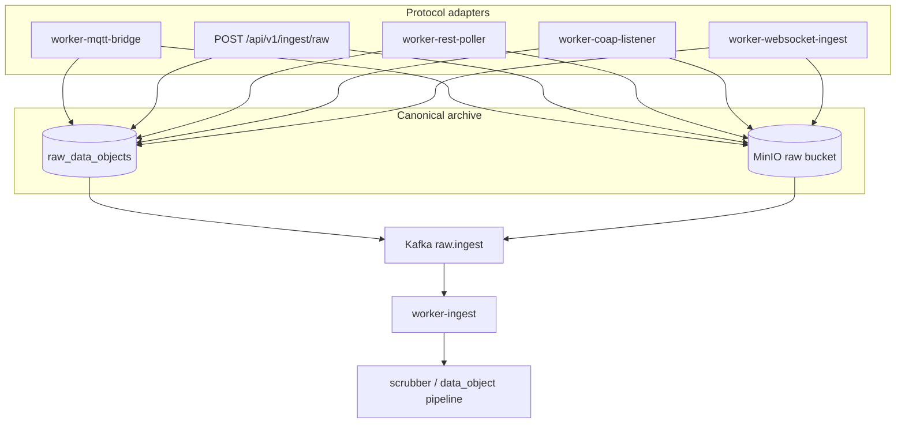

# Manage Devices — structure and ingest pipelines

This document describes how **Manage Devices** is organized in the product and codebase, with emphasis on **per-protocol ingest pipelines** (how telemetry reaches `raw_data_objects` and what runs downstream).

> V2 note: endpoint-first ingest is now authoritative. Durable ingest requires endpoint resolution; product/runtime reads should use `latest_device_state`, `scrubbed_events`, and `resolved_devices`.

For frozen contracts and identity rules, see:

- `docs/CANONICAL_INGRESS_PRODUCT.md` — approved modes and mandatory pipeline
- `docs/CANONICAL_RAW_INGEST.md` — SoT, Kafka envelope, lifecycle
- `docs/CANONICAL_DEVICE_IDENTITY_INGEST.md` — endpoint-bound vs payload resolution
- `docs/ARCHITECTURE_MQTT_INGEST.md` — MQTT bridge grouping, env hooks, monitoring

---

## 1. Product surface (UI)

Under **Manage Devices** in the shell, three routes share the same operational area:

| Route | Page component | Role |
|--------|----------------|------|
| `/devices/register` | `DeviceRegisterPage` | Fleet table: sites, devices, **connectivity / liveness KPIs**, filters, bulk actions, links into per-device manage |
| `/devices/manage` | `DeviceManagePage` | **Single-device** editor: protocol, endpoint JSON (`config`), polling interval, validate, **raw payload preview**, MQTT / static JSON panels where applicable |
| `/devices/raw` | `DeviceRawDataPage` | Browse **raw archives** (`raw_data_objects`) across devices |

Navigation is declared in `services/frontend/src/layouts/shell/navigation.ts` (`MAIN_NAV_FLAT_LINKS` — “Manage Devices” highlights all three paths).

---

## 2. Domain model (what “Manage Devices” configures)

### `devices`

- One row per logical device (UUID primary key, `customer_id`, `site_id`, name, liveness thresholds, `last_seen_at`, etc.).
- Devices are the **identity anchor** for archived raw and downstream scrubber / dashboards.

### `device_endpoints` (one row per device)

- **1:1** with `devices` via `device_endpoints.device_id` (unique FK).
- **`protocol`**: `http`, `mqtt`, `coap`, `websocket` (API normalizes legacy `socket` → `websocket`).
- **`config`**: JSONB — **worker-oriented** shape; the UI maps forms ↔ JSON in `services/frontend/src/lib/deviceEndpointConfig.ts` (`configTo*Fields`, `*FieldsToConfig`, `buildConfigFromFields`).
- **`polling_interval_seconds`**: used for REST **Pull** cadence and timeliness heuristics in validation.
- **`is_active`**: when false, device + endpoint are excluded from pollers / MQTT subscription plan (see workers).
- **Operational columns**: `activation_status`, `validation_status`, `validation_detail`, `first_payload_at`, `last_payload_at`, `last_error`, `operational_status`, `last_verified_at`.

Allowed `activation_status` values are centralized in `services/api/app/core/endpoint_activation.py` (`ACTIVATION_STATUS_VALUES`).

---

## 3. Canonical ingest pipeline (all approved modes)

Every approved ingress mode is required to converge on the **same** path after the protocol-specific adapter:

```text
Ingress adapter (per protocol)
  → Postgres `raw_data_objects` + MinIO object at `storage_key`
  → Kafka `raw.ingest` (RawIngestEnvelopeV1)
  → `worker-ingest`
  → `scrubber.input` (when enabled)
  → `data_object` / downstream analytics
```



**Manage Devices** configures **which adapter** applies and **with what parameters**; it does not replace workers or short-circuit MinIO/Postgres.

---

## 4. Per-protocol pipelines (Manage Devices → runtime)

The table maps **saved `device_endpoints`** to **processes** and **config highlights**. All paths that archive JSON ultimately use `services/workers/app/ingest_archive.py` (`ingest_json_payload_for_endpoint`, `ingest_json_payload_for_device`, or `ingest_json_payload` for unbound cases).

| Protocol (UI/API) | Product modes | Primary worker / API | Binding |
|-------------------|---------------|----------------------|---------|
| **HTTP** (`http`) | **Push to Platform** — `rest_mode: inbound_hook` | `POST /api/v1/ingest/raw` (JWT); caller supplies target `device_id` | Caller chooses device; not driven by endpoint URL row for push |
| **HTTP** (`http`) | **Pull from Upstream** — `rest_mode: polling` | `worker-rest-poller` reads `device_endpoints` and polls `config.url` / host+path | **Endpoint row** → `ingest_json_payload_for_device` |
| **MQTT** (`mqtt`) | Subscriber ingest | `worker-mqtt-bridge` loads plan from DB (`mqtt_bridge_subscriptions.build_ingest_plan`) | Topic match → **`ingest_json_payload_for_endpoint`** |
| **CoAP** (`coap`) | Listener / adapter | `worker-coap-listener` (when deployed) | Often **unbound** → `ingest_json_payload` + `resolve_device_row` unless routed by future binding |
| **WebSocket** (`websocket`) | Ingest client | `worker-websocket-ingest` (when deployed) | **Endpoint row** → `ingest_json_payload_for_device` |

### 4.1 REST (`http`)

- **Config shape**: `rest_mode` (`inbound_hook` | `polling`), `url` or host/port/path, `method`, `timeout_seconds`, auth, headers; see `httpFieldsToConfig` / `configToHttpFields` in `deviceEndpointConfig.ts`.
- **Push**: Operators document the platform ingest URL and credentials; the endpoint row marks the device as REST-capable; **no upstream URL** is required for pure push.
- **Pull**: `worker-rest-poller` uses the saved URL and interval; failures and success touch endpoint lifecycle and metrics.

### 4.2 MQTT (`mqtt`)

- **Config shape**: `broker_mode`, `broker_host`, `broker_port`, `topic`, `qos`, optional `username` / `password` / `client_id`, `use_tls` (see `mqttFieldsToConfig`).
- **Bridge behavior**: one MQTT **client per distinct connection profile** (host, port, TLS, auth, explicit client id); merged subscriptions per topic with max QoS. Optional **`MQTT_TOPICS`** on **`MQTT_BROKER_HOST`** only — not a substitute for per-device `broker_host`.
- **Resync**: plan reload on `MQTT_TOPIC_RESYNC_SECONDS` (default 90s) so Manage Devices saves propagate without restarting the worker.

Details: `docs/ARCHITECTURE_MQTT_INGEST.md`.

### 4.3 CoAP (`coap`)

- **Config shape**: listener-oriented (`adapter_role`, `host`, `port`, `path`, `method`, `security`, etc.) in `coapFieldsToConfig`.
- **Pipeline**: UDP listener → same archive + Kafka path when the worker is enabled in deployment.

### 4.4 WebSocket (`websocket`)

- **Config shape**: `url`, `use_tls`, `subprotocol`, reconnect/ping, optional `headers_json` in `webSocketFieldsToConfig`.
- **Pipeline**: platform opens client to upstream URL, frames → archive + Kafka.

---

## 5. API layer (device endpoints)

Router prefix: **`/api/v1/device-endpoints`** (`services/api/app/api/v1/router.py`).

| Concern | Module / handler |
|---------|------------------|
| CRUD | `services/api/app/api/v1/device_endpoints.py` — `POST` upsert by `device_id`, `PATCH /{endpoint_id}` |
| Get + observability | `GET` returns `DeviceEndpointGetResponse` with `endpoint` + **`observability`** (built in `device_endpoint_observability.build_observability`) |
| Validate | `POST /device-endpoints/validate` — `device_endpoint_validation.run_endpoint_validation` (TCP/connectivity + **payload receipt** / staleness vs device `late_threshold_seconds`) |
| Lifecycle hooks | `device_endpoint_lifecycle.sync_activation_after_save` / `sync_activation_after_validation` |

**Connectivity column** on the register page maps `validation_status`: `ok` → Valid, `warning` → Degraded (e.g. broker OK but no raw yet or stale receipt), `failed` → Invalid.

---

## 6. Frontend config pipeline (forms ↔ JSON)

- **Single source of field shapes**: `services/frontend/src/lib/deviceEndpointConfig.ts`.
- **Manage page** (`DeviceManagePage.tsx`): holds local state per protocol (`httpF`, `mqttF`, `coapF`, `wsF`), builds `config` via `buildConfigFromFields`, submits to `POST`/`PATCH` device-endpoints APIs, runs validate, loads observability and latest raw preview.
- **Register page** (`DeviceRegisterPage.tsx`): aggregates **devices + embedded endpoint** from list APIs, derives KPI buckets from `validation_status`, liveness display state, and activation.

---

## 7. Post-ingest: lifecycle and liveness

After a successful archive, workers call into **`device_endpoint_lifecycle`** (e.g. `touch_after_archived_success`, `record_ingest_failure`) to update `device_endpoints` / `devices` timestamps and errors, and Redis-backed liveness hints (`liveness_redis`, etc.) so the **Operations** / device table views stay consistent with ingest reality.

---

## 8. Key file index (pipelines)

| Area | Path |
|------|------|
| MQTT plan + subscribe | `services/workers/app/mqtt_bridge_subscriptions.py`, `mqtt_bridge.py` |
| Shared archive + Kafka | `services/workers/app/ingest_archive.py` |
| DB URL (workers) | `services/workers/app/db_url.py` |
| REST poller | `services/workers/app/rest_poller.py` |
| CoAP | `services/workers/app/coap_listener.py` (entry) |
| WebSocket ingest | `services/workers/app/ws_ingest.py` |
| API raw ingest | `services/api` — `raw_ingest` / ingest routes (JWT) |
| Connectivity probe (validate) | `services/api/app/services/device_endpoint_connectivity.py` |
| Validation compose | `services/api/app/services/device_endpoint_validation.py` |

---

## 9. Operational checklist

1. **Save** endpoint on **Manage device** — invalidates prior validation until re-run.
2. **Run workers** for the chosen protocol (`docker-compose.yml` services: `worker-mqtt-bridge`, `worker-rest-poller`, etc.).
3. **Network**: adapters run **in containers**; LAN brokers must be reachable from those containers, not only from the operator laptop.
4. **Validate** on Manage device — refreshes connectivity + payload-receipt narrative and persists `validation_status` / `validation_detail`.
5. **Preview** — reads `raw_data_objects` / MinIO via API after the canonical pipeline has produced a row.

This README is the **map** from UI + `device_endpoints` to workers; contract details remain in the canonical docs linked at the top.

---

## 10. V2 invariants and retention

### Invariants

- `endpoint_id` resolution is mandatory before archive + scrubber publish.
- Unbound ingest (`anonymous`, `device-only`, payload-derived tenant identity) is rejected or quarantined.
- V2 writer flow is `raw_data_objects` -> `scrubbed_events` -> `latest_device_state` with `resolved_devices` identity.
- Product/runtime surfaces should bind to v2 models, not legacy `data_object` identifiers.

### Retention / TTL baseline

- `raw_data_objects`: retain bounded raw archive; prune rows + MinIO payloads together.
- `ingest_quarantine`: short TTL (debug horizon), indexed by `expires_at`.
- `scrubbed_events`: bounded historical retention by event time.
- `latest_device_state`: no history TTL (single current row per identity key).
- workflow executions/log caches/Redis keys: explicit TTL by subsystem policy.
- reset commands must clear metadata rows and linked object storage consistently.
